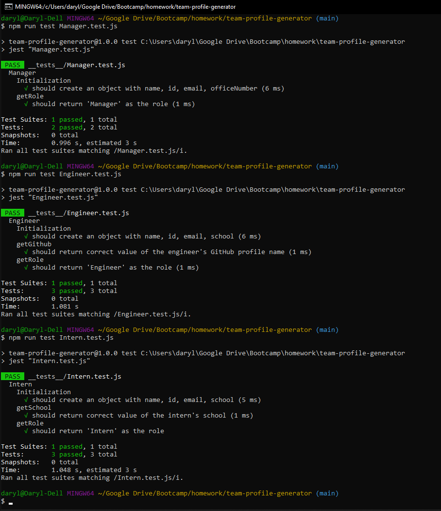
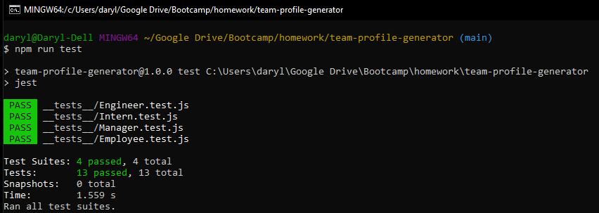

# Homework Assignment - 10 Object-Oriented Programming: Team Profile Generator

## Table of Contents
[Description](#description)

[Key Features](#key-features)

[License](#license)

[Walkthrough Video](#walkthrough-video)

[Screenshots](#screenshots)

## Description
The focus of this homework assignment for the University of Toronto SCS Coding Boot Camp was to build a Node.js command-line application that takes in information about employees on a software engineering team, then generates an HTML webpage that displays summaries for each person. Unit tests were written for the code.

## Key Features
- Inquirer package available from [npm](https://www.npmjs.com/) allows for the command line prompts and user responses to be captured.
- Built in file system module from Node.js is used to create and write to a file, i.e. index.html.
- Jest was used for running unit tests and there is a test for each class (Employee, Manager, Engineer and Intern)
- Classes, subclasses and constructors 
- Bootstrap is used to help create a responsive website that includes the employee cards, styling, etc.
- The HTML file that is created is based on user input from the command line prompts (e.g., the number of employee cards generated and content within each of them)

## Walkthrough Video
The following video demonstrates the application's functionality.
- [Video]()

## License
This product is under the MIT License.

## Screenshots
The images below show aspects of the application including the prompts at the command line for the user and a sample HTML file.

